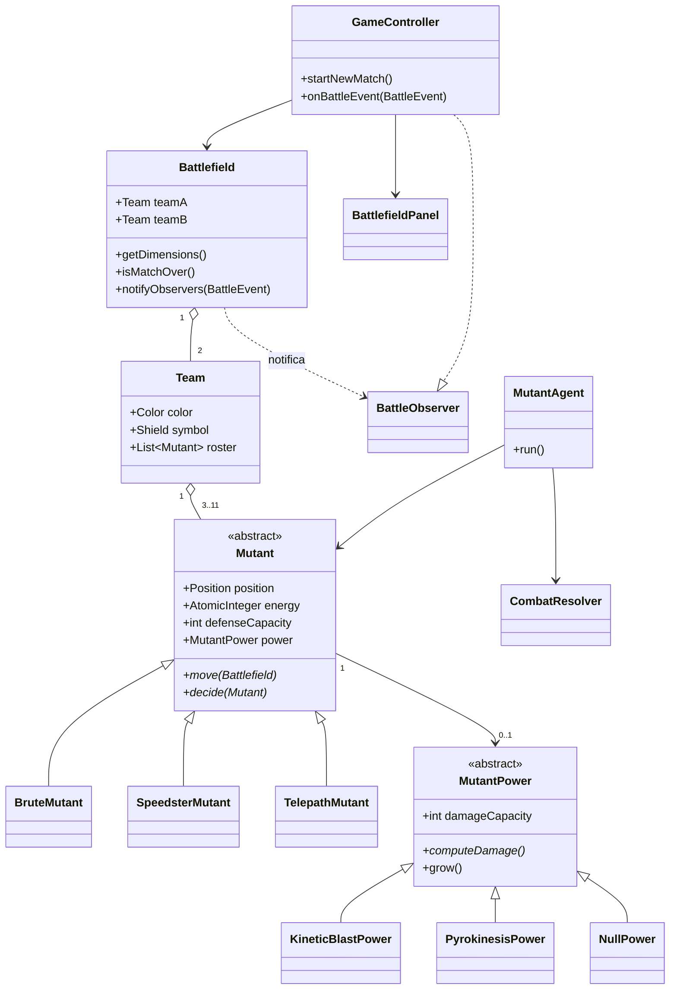

Mutant Battle — Especificación de Diseño
Proyecto del curso: Caso #1 – Mutant Battle (25%)
Estado: Borrador para revisión del profesor — todavía no se ha escrito código.
Ubicación en el repositorio: `/docs/SPEC.md` (carpeta `docs` en la raíz, versionada junto al código fuente una vez aprobada)
---
1. Descripción general
Mutant Battle es una simulación que corre sola. El usuario únicamente indica el tamaño de los equipos (entre 3 y 11, igual para ambos). A partir de ahí el sistema genera dos equipos de mutantes aleatorios y ejecuta la batalla hasta el final sin intervención del usuario, animándola en vivo en una interfaz Swing.
El sistema se divide en cuatro capas con una separación estricta de responsabilidades:
Capa	Responsabilidad
Modelo	Datos puros + comportamiento de las entidades del juego (Mutante, PoderMutante, Equipo)
Juego	El campo de batalla: ciclo de vida de los equipos, marcador, condición de victoria, dimensiones
Control	Movimiento, detección de encuentros, resolución de ataque/defensa, hilos (threading)
UI	Solo renderizado con Swing, mediante Observer + MVC, sin lógica de juego
1.1 Patrones de diseño utilizados
Observer — `Battlefield` (sujeto) notifica a los `BattleObserver` (la UI) ante cada cambio de estado (movimiento, ataque, muerte, fin de la partida).
MVC — Modelo = paquete `Model` (estado de Mutante/Equipo/Battlefield); Vista = `BattlefieldPanel`/`ScoreboardPanel`; Controlador = `GameController` (maneja inicio/reinicio, conecta el Modelo con la Vista, nunca dibuja ni calcula daño).
Strategy — `MovementStrategy` (patrón de movimiento por arquetipo de mutante) y `CombatDecisionStrategy` (decisión de atacar o defender).
Factory Method — `MutantFactory` / `PowerFactory` construyen mutantes y poderes aleatorios, de modo que la creación de equipos no tenga `new AlgúnMutanteConcreto()` disperso por el código.
Template Method — `Mutant.act()` define el esqueleto fijo (mover → detectar radio → decidir → resolver); las subclases solo sobrescriben las partes que varían.
Singleton — `GameConstants` (o un contenedor de constantes cargado una sola vez) y `ExecutorServiceProvider`.
No hay números ni cadenas literales "quemadas" en las clases de lógica; todo pasa por `GameConstants`.
---
2. Constantes (`GameConstants`)
Constante	Descripción	Valor de ejemplo
`MIN_TEAM_SIZE`	Mínimo de mutantes por equipo	3
`MAX_TEAM_SIZE`	Máximo de mutantes por equipo	11
`INITIAL_ENERGY`	Energía inicial de cada mutante	100
`MIN_DEFENSE`, `MAX_DEFENSE`	Rango de capacidad de defensa	1, 3
`MIN_DAMAGE`, `MAX_DAMAGE`	Rango de daño inicial del poder	1, 3
`MAX_POWER_LEVEL`	Tope de crecimiento del poder	7
`POWER_GROWTH_STEP`	Incremento por golpe exitoso	1
`ENCOUNTER_RADIUS`	Distancia que dispara una decisión	configurable, p. ej. 40px
`MIN_SPEED`, `MAX_SPEED`	Límites de velocidad de movimiento	2, 6
`BATTLEFIELD_WIDTH`, `BATTLEFIELD_HEIGHT`	Dimensiones del campo de batalla	1000, 700
`REFRESH_RATE_MS`	Intervalo de refresco de la UI	33 (~30 FPS)
`THREAD_POOL_SIZE`	Hilos trabajadores para los agentes mutantes	`Runtime.getRuntime().availableProcessors()`
Todas son `public static final` en una clase no instanciable (o un `enum` singleton), cargadas desde una única fuente para que ninguna otra clase incruste números/cadenas directamente.
---
3. Capa de Modelo
3.1 `Position` / `Vector2D`
Objeto de valor (casi inmutable): `x`, `y`, más un `heading` (ángulo) usado por el movimiento. Métodos útiles: `distanceTo(Position)`, `translate(dx, dy)`, `clamp(width, height)`.
3.2 `MutantPower` (abstracta)
```
abstract class MutantPower {
    protected int damageCapacity;      // 1..3 inicialmente, crece hasta MAX_POWER_LEVEL
    String name;

    abstract int computeDamage();      // polimórfico: algunos poderes pueden agregar efectos
    void grow() { damageCapacity = min(damageCapacity + POWER_GROWTH_STEP, MAX_POWER_LEVEL); }
}
```
Subclases concretas (polimorfismo, cada una sobrescribe `computeDamage()` / agrega un matiz propio, p. ej. probabilidad de un efecto secundario): `KineticBlastPower`, `PyrokinesisPower`, `TelepathicStrikePower`, `RegenerationAssistPower` (modificador de soporte), etc. `PowerFactory` elige uno al azar por mutante y le asigna un `damageCapacity` aleatorio en `[MIN_DAMAGE, MAX_DAMAGE]`.
Un mutante puede portar como máximo un poder (manejo seguro de nulos: un objeto `NullPower`/`NoPower`, patrón Null Object, evita verificaciones de nulo dispersas en la capa de Control).
3.3 `Mutant` (abstracta — extiende el modelo de la Semana #5)
```
abstract class Mutant {
    String id, name;
    Team team;
    Position position;
    int speed;
    int defenseCapacity;      // 1..3
    AtomicInteger energy;     // inicia en INITIAL_ENERGY, mutación segura entre hilos
    MutantPower power;
    volatile boolean alive;

    // Template method – esqueleto fijo, pasos sobrescritos por las subclases
    final void act(Battlefield field) {
        move(field);
        // la detección de encuentros la maneja la capa de Control (MutantAgent)
    }

    abstract void move(Battlefield field);        // gancho del patrón de movimiento
    abstract CombatAction decide(Mutant opponent); // gancho ATACAR o DEFENDER

    void applyDamage(double amount) { ... }        // resta energía, puede matar
    void rewardSuccessfulHit() { power.grow(); }
}
```
Las subclases concretas demuestran herencia/polimorfismo por arquetipo, cada una con su propio `move()` y sesgo en `decide()`, por ejemplo:
`BruteMutant` — lento, sesgado a atacar, se mueve en ráfagas rectas.
`SpeedsterMutant` — rápido, movimiento errático en zigzag, sesgado a esquivar/defender.
`TelepathMutant` — velocidad media, patrón de movimiento circular/orbital, decisión balanceada.
`MutantFactory` (Factory Method) construye un arquetipo al azar + estadísticas aleatorias + un poder aleatorio para cada cupo del equipo.
3.4 `Team`
```
class Team {
    String name;
    Color color;
    Shield symbol;                 // enum o clase pequeña: forma + ícono
    List<Mutant> roster;           // tamaño fijo (3..11)
    int aliveCount(); int deadCount();
}
```
---
4. Capa de Juego
4.1 `Battlefield` (el Sujeto del Observer)
Contiene `Team teamA`, `Team teamB`, dimensiones (`width`, `height`) y el `Scoreboard` en ejecución.
`getDimensions()` — expuesto para que cualquier `Mutant`/`MutantAgent` pueda acotar su movimiento.
Monitorea continuamente los conteos de vivos/muertos por equipo (delega en `Team`, agrega para el marcador).
`isMatchOver()` → verdadero cuando el `aliveCount()` de un equipo llega a 0.
`getWinner()` → el `Team` sobreviviente (o manejo de empate si es simultáneo).
Implementa el lado sujeto del Observer: `registerObserver(BattleObserver)`, `notifyObservers(BattleEvent)`. Cada mutación (tick de movimiento, ataque resuelto, muerte, fin de partida) dispara un evento; nunca se comunica directamente con Swing.
4.2 `Scoreboard`
Agregador simple: vivos/muertos por equipo, ticks transcurridos, registro de eventos (opcional), consumido por la UI a través del callback del observer, nunca calculado por la UI.
4.3 `BattleEvent`
Objeto de evento inmutable (`MOVED`, `ATTACK_RESOLVED`, `MUTANT_DIED`, `MATCH_OVER`, …) que lleva justo los datos necesarios para que la UI redibuje sin recalcular nada.
---
5. Capa de Control
5.1 Movimiento
Interfaz `MovementStrategy`, una implementación por arquetipo (patrón Strategy), invocada desde `Mutant.move()`. El movimiento es aleatorio pero con patrón (p. ej. caminata aleatoria acotada con momentum/persistencia del rumbo en vez de una dirección nueva cada tick), y siempre acotado a las dimensiones del `Battlefield`.
5.2 Detección y resolución de encuentros
`MutantAgent implements Runnable` — un agente envuelve a un `Mutant`. En cada tick: mueve al mutante y luego escanea el campo en busca de oponentes dentro del `ENCOUNTER_RADIUS`.
Por cada oponente encontrado dentro del radio se genera exactamente un intercambio de ataque/defensa por par no ordenado, por tick (el par se deduplica con una clave canónica, p. ej. `min(idA,idB)+"-"+max(idA,idB)`, guardada en un `ConcurrentHashMap<String, Boolean>` que se limpia cada tick) — esto cumple con "varios oponentes en el radio → una sola acción por par".
`CombatDecisionStrategy` (Strategy) decide ATACAR o DEFENDER por mutante y por encuentro, según el sesgo de su arquetipo + su energía actual (p. ej., poca energía → más probable defender).
`CombatResolver` aplica las reglas:
El atacante ataca, el defensor no defiende → `daño = power.computeDamage()`.
El atacante ataca, el defensor sí defiende → `daño = power.computeDamage() / defensor.defenseCapacity`.
Ante cualquier daño exitoso, el poder de quien lo causó crece (`power.grow()`, tope en `MAX_POWER_LEVEL`).
La aplicación del daño resta `energy` mediante `AtomicInteger`; si `energy <= 0` → `alive = false`, se actualiza el conteo del `Team`, se notifica al `Battlefield` (`MUTANT_DIED`).
5.3 Esquema de hilos (threading)
Un único `ExecutorService` (pool fijo de hilos, dimensionado con `GameConstants.THREAD_POOL_SIZE`) compartido por ambos equipos — no un `Thread` crudo por mutante, para mantener el uso de recursos acotado sin importar el tamaño del equipo (3–11 por lado).
En cada tick de la simulación se envían al pool todas las tareas `MutantAgent`, y el tick avanza solo cuando todos los futuros de ese tick terminan (barrera vía `CompletableFuture.allOf` o un `CyclicBarrier`), de modo que el movimiento/combate se mantengan sincronizados lógicamente por cuadro, aunque se ejecuten en paralelo.
El estado mutable compartido (`energy`, banderas de vivo/muerto, mapa de deduplicación de pares, rosters de equipos) usa tipos seguros para concurrencia (`AtomicInteger`, `volatile boolean`, `ConcurrentHashMap`, `CopyOnWriteArrayList` para los rosters leídos por la UI) para evitar bloqueos amplios explícitos; donde un intercambio debe ser atómico (p. ej., resolver el ataque/defensa de un par y aplicar el daño), el bloqueo se acota a ese par (`synchronized` sobre la clave canónica del par, o un `ReentrantLock` obtenido de un registro de locks por par) — nunca un bloqueo global único, para que encuentros no relacionados en distintas zonas del campo sigan corriendo en paralelo.
Las llamadas a `Battlefield.notifyObservers(...)` se despachan al hilo de eventos de Swing (EDT) mediante `SwingUtilities.invokeLater`, de modo que la capa de Control nunca toca componentes de UI directamente y se respeta la seguridad de hilos de Swing.
---
6. Capa de UI (Observer + MVC)
6.1 Roles
Modelo — `Battlefield`, `Team`, `Mutant` (ya definidos arriba); la UI nunca los modifica, solo los lee.
Vista — `BattleFrame` (JFrame), `BattlefieldPanel` (JPanel/Canvas que dibuja a los mutantes en su `Position` actual, coloreados/simbolizados por `Team`), `ScoreboardPanel` (conteos de vivos/muertos, barras de energía por mutante, anuncio del ganador).
Controlador — `GameController`: lee el tamaño de equipo indicado por el usuario, invoca a `MutantFactory`/`Battlefield` para armar la partida, arranca el bucle del `ExecutorService`, implementa `BattleObserver` y reenvía los `BattleEvent` recibidos a la Vista para redibujar, y expone `startNewMatch()` para reiniciar todo tras una victoria.
6.2 Conexión del Observer
```
interface BattleObserver { void onBattleEvent(BattleEvent e); }
```
`GameController` (o un `BattlefieldViewModel` delgado) implementa `BattleObserver`, se registra en `Battlefield`, y ante cada evento dispara `BattlefieldPanel.repaint()` / `ScoreboardPanel.refresh()`. Un `javax.swing.Timer` con periodo `GameConstants.REFRESH_RATE_MS` marca el ritmo real de redibujado para que el lienzo se vea fluido incluso entre eventos discretos.
6.3 Elementos que debe mostrar
Todos los mutantes vivos, posicionados y moviéndose simultáneamente, coloreados/simbolizados por equipo.
Energía de cada mutante (p. ej., una barrita o etiqueta numérica).
Conteos de vivos/muertos por equipo (marcador).
Anuncio del ganador al terminar la partida (a partir de `BattleEvent.MATCH_OVER`).
Un control de "Nueva partida" que llama a `GameController.startNewMatch()`, el cual desmonta el executor, reconstruye dos equipos nuevos del mismo tamaño y vuelve a registrar los observers.
---
7. Secuencia — un tick de simulación
`GameController` envía todos los `MutantAgent` al `ExecutorService`.
Cada `MutantAgent`: `mutant.move(battlefield)` → se actualiza la posición.
Cada `MutantAgent` escanea el campo buscando oponentes dentro del `ENCOUNTER_RADIUS`.
Por cada par nuevo (no deduplicado aún) en este tick: ambos mutantes invocan `decide()`; `CombatResolver` resuelve ataque/defensa, aplica daño, hace crecer el poder, actualiza energía.
Cualquier muerte dispara la actualización del conteo del `Team` + `Battlefield.notifyObservers(MUTANT_DIED)`.
Cuando todos los agentes terminan el tick (barrera), `Battlefield` verifica `isMatchOver()`; si es verdadero, notifica `MATCH_OVER` con el equipo ganador y deja de enviar más ticks.
La UI (en el EDT) redibuja a partir del último estado del Modelo ante cada evento notificado y en cada ciclo del `Timer`.
---
8. Diagrama de Clases (alto nivel)

---
9. Estructura del Repositorio (propuesta)
```
mutant-battle/
├── docs/
│   └── SPEC.md              <- este documento
├── src/main/java/mutantbattle/
│   ├── model/                (Mutant, MutantPower, Team, Position, ...)
│   ├── game/                 (Battlefield, Scoreboard, BattleEvent)
│   ├── control/              (MutantAgent, MovementStrategy, CombatDecisionStrategy, CombatResolver)
│   ├── ui/                   (BattleFrame, BattlefieldPanel, ScoreboardPanel, GameController, BattleObserver)
│   └── util/                 (GameConstants, MutantFactory, PowerFactory)
└── README.md

